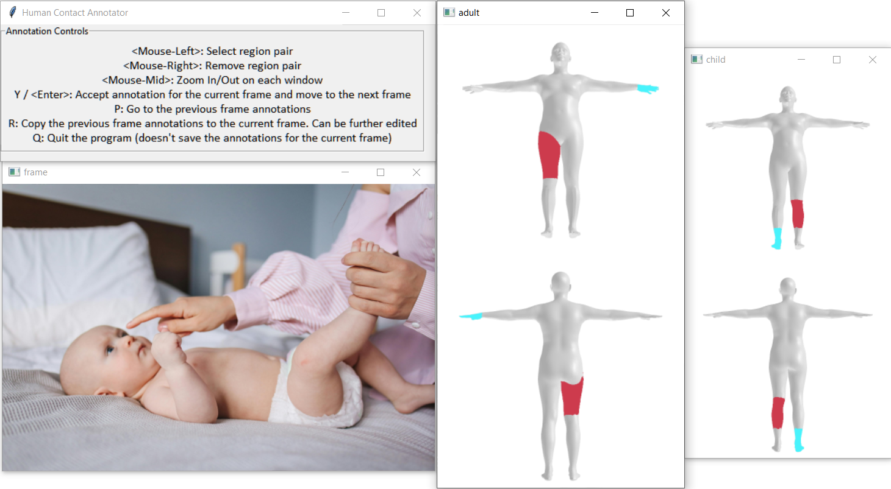
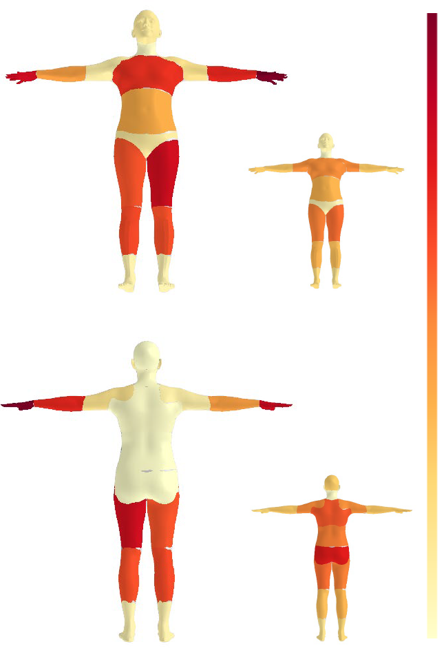
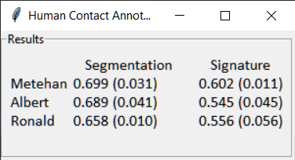

# HumanContactAnnotator

In dyadic interactions, observing physical contact between interactants is crucial to understand the nature and quality of their interaction. To facilitate the systematic annotation of physical contact from images, we developed Human Contact Annotator, an intuitive tool to label body parts in contact. The tool is publicly available to enable research into analyzing contact signatures and physical contact in dyads during close proximity interactions. In addition to annotating body region-based contact signatures, our tool allows for informative contact segmentation visualizations, which provide quick insights into the nature of touch over an extended period.

You can find our unimodal method [Pose2Contact](https://github.com/dmetehan/Pose2Contact) and multimodal approach [Image2Contact](https://github.com/dmetehan/Image2Contact) presented in the paper "Decoding Contact: Automatic Estimation of Contact Signatures in Parent-Infant Free Play Interactions".

## Installation

* Python 3.8+ (https://www.python.org/downloads/)
* If you have git installed:
  > git clone https://github.com/dmetehan/HumanContactAnnotator.git
  * Otherwise, download https://github.com/dmetehan/HumanContactAnnotator/archive/refs/heads/main.zip and unzip
* Inside the HumanContactAnnotator folder:
  > pip install -r requirements.txt
* > python main.py

## Usage

* Annotating Contact Signatures:

  
* Visualizing Region Contact Frequencies:

  
* Calculating Inter-annotator Agreement:

  

## Citation

To cite our work on HumanContactAnnotator:
```
@inproceedings{10.1145/3686215.3689346,
author = {Doyran, Metehan and Salah, Albert Ali and Poppe, Ronald},
title = {Human Contact Annotator: Annotating Physical Contact in Dyadic Interactions},
year = {2024},
isbn = {9798400704635},
publisher = {Association for Computing Machinery},
address = {New York, NY, USA},
url = {https://doi.org/10.1145/3686215.3689346},
doi = {10.1145/3686215.3689346},
booktitle = {Companion Proceedings of the 26th International Conference on Multimodal Interaction},
pages = {97–99},
location = {San Jose, Costa Rica},
series = {ICMI Companion '24}
}
```
To cite our work on detecting contact signatures:
```
@inproceedings{10.1145/3678957.3685719,
author = {Doyran, Metehan and Salah, Albert Ali and Poppe, Ronald},
title = {Decoding Contact: Automatic Estimation of Contact Signatures in Parent-Infant Free Play Interactions},
year = {2024},
isbn = {9798400704628},
publisher = {Association for Computing Machinery},
address = {New York, NY, USA},
url = {https://doi.org/10.1145/3678957.3685719},
doi = {10.1145/3678957.3685719},
booktitle = {Proceedings of the 26th International Conference on Multimodal Interaction},
pages = {38–46},
location = {San Jose, Costa Rica},
series = {ICMI '24}
}
```
